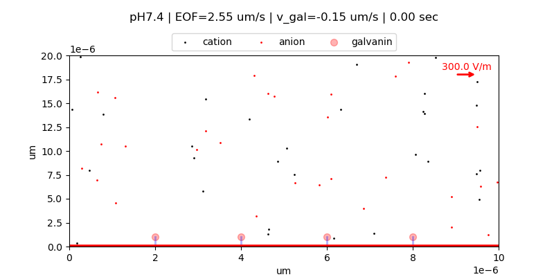

# galvanotaxis-simulation
This notbook is a toy 2D simulatior for galvanotaxis / electrotaxis intuition building.  
y=0 (visualized as the red line on the bottom of the plot) represents zebrafish keratocyte cell surface which is plasma membrane. 

## Overall movement of galvanin
Δx = Electrophoresis + Drift + Brownian diffusion 
&emsp;&ensp;= [μg ⋅ qg ⋅ E ⋅ ​Δt] + [umem ⋅ ​Δt] + [sqrt(2 ⋅ Dg ⋅ ​Δt) ⋅ η]
- μg : electrophoretic mobility of galvanin (m^2/(V⋅s))
- qg : charge of galvanin; - 18e (currently set to -1 for simplicity)
- E : electric field in +x direction
- umem : effective slip-like drift on membrane
- Dg : membrane lateral diffusion coefficient (m^2/s)

## Current Output
Simulation output is displayed in matplotlib plot, and saved as animated mp4 or gif.

[Watch the MP4 demo](./galvanotaxis_simulation_20260325.mp4)

## Features
See `Calculations.md` for details 

### Features included
- x-directed electrophoresis and Brownian diffusion of galvanin
- x-directed electrophoresis of ion particles
- Helmholtz-Smoluchowski bulk electro-osmotic flow approximation applied as a uniform x-directed drift to ion particles
- Zeta potential according to pH

#### Note:
- ions are bounded periodically in x (they loop)
- galvanin has clamped boundary between 0 and 10um (they don't loop) 

### Features To-Do
- effective charge of galvanin
- cell surface charge
    - Debye length
- H+ particle as separate species
    - will be implemented as coarse-grained particle
- y-dependent EOF
- titration of galvanin charge
- Brownian diffusion of ion particles

### Features ignored
- y-directional movement of galvanin (since it is a membrane protein)
- EOF of galvanin
- particle collision dynamics
- particle-particle Coulomb long-range interaction
- hydrodynamic interaction
- real concentration calibration

## Files
- Jupyter notebooks for simulation and visualization

## Requirements
See `requirements.txt`.